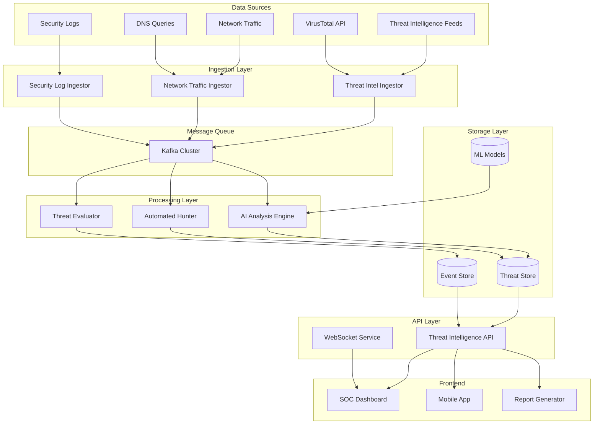

# AI-Powered Cybersecurity Threat Intelligence Platform - Design Document

## Overview

The AI-Powered Cybersecurity Threat Intelligence Platform is a distributed microservices architecture that provides real-time threat detection, analysis, and response capabilities. The system leverages machine learning algorithms, threat intelligence feeds, and behavioral analytics to identify and mitigate cybersecurity threats proactively.

The platform transforms our existing financial risk architecture into a sophisticated security monitoring system that can handle enterprise-scale threat detection with sub-second response times and 99.9% availability.

## Architecture

### High-Level Architecture



### Microservices Architecture

1. **Threat Intelligence Ingestor**: Collects and normalizes threat feeds
2. **Network Traffic Ingestor**: Processes network logs and traffic data
3. **AI Analysis Engine**: Machine learning-based threat detection
4. **Threat Evaluator**: Risk scoring and correlation engine
5. **Automated Hunter**: Proactive threat hunting service
6. **Threat Intelligence API**: RESTful API for threat data access
7. **SOC Dashboard**: Real-time security operations center interface

## Components and Interfaces

### Threat Intelligence Ingestor

**Purpose**: Collect, normalize, and validate threat intelligence from multiple sources

**Key Features**:
- Multi-source threat feed integration (MISP, STIX/TAXII, commercial feeds)
- Data normalization and deduplication
- Threat indicator validation and enrichment
- Rate limiting and API quota management

**Interfaces**:
- Input: External threat intelligence APIs, RSS feeds, JSON/XML data
- Output: Kafka topics (threat-indicators, iocs, threat-reports)
- Configuration: Environment variables, threat source credentials

**Data Processing**:
```javascript
// Threat indicator normalization
{
  id: "uuid",
  type: "ip|domain|hash|url",
  value: "192.168.1.1",
  confidence: 85,
  severity: "high|medium|low",
  first_seen: "2024-01-01T00:00:00Z",
  last_seen: "2024-01-01T00:00:00Z",
  tags: ["malware", "botnet"],
  source: "threat-feed-name",
  tlp: "white|green|amber|red"
}
```

### AI Analysis Engine

**Purpose**: Apply machine learning algorithms for anomaly detection and threat classification

**Key Features**:
- Real-time behavioral analysis
- Anomaly detection using unsupervised learning
- Threat classification with supervised models
- Model versioning and A/B testing

**ML Models**:
1. **Network Anomaly Detection**: Isolation Forest, LSTM for time series
2. **Malware Classification**: Random Forest, Neural Networks
3. **User Behavior Analytics**: Clustering, Statistical Analysis
4. **Attack Pattern Recognition**: Deep Learning, Pattern Matching

**Model Pipeline**:
```python
# Simplified ML pipeline structure
class ThreatDetectionPipeline:
    def __init__(self):
        self.preprocessor = DataPreprocessor()
        self.anomaly_detector = IsolationForest()
        self.classifier = RandomForestClassifier()
        self.feature_extractor = FeatureExtractor()
    
    def predict_threat(self, network_data):
        features = self.feature_extractor.extract(network_data)
        anomaly_score = self.anomaly_detector.decision_function(features)
        threat_class = self.classifier.predict_proba(features)
        return self.calculate_risk_score(anomaly_score, threat_class)
```

### Threat Evaluator

**Purpose**: Calculate composite risk scores and correlate threats across multiple dimensions

**Risk Scoring Algorithm**:
```javascript
// Multi-factor risk scoring
function calculateThreatScore(indicators) {
  const factors = {
    severity: indicators.severity_weight * 0.3,
    confidence: indicators.confidence_score * 0.25,
    asset_criticality: indicators.target_value * 0.2,
    attack_sophistication: indicators.complexity_score * 0.15,
    temporal_relevance: indicators.recency_factor * 0.1
  };
  
  const baseScore = Object.values(factors).reduce((sum, val) => sum + val, 0);
  const multiplier = indicators.correlation_count > 1 ? 1.2 : 1.0;
  
  return Math.min(100, Math.round(baseScore * multiplier));
}
```

### SOC Dashboard

**Purpose**: Provide real-time security monitoring and incident management interface

**Key Features**:
- Real-time threat visualization
- Interactive threat timeline
- Incident response workflows
- Customizable security metrics
- Mobile-responsive design

**Dashboard Components**:
1. **Threat Overview**: Current threat level, active incidents
2. **Attack Map**: Geospatial threat visualization
3. **Threat Timeline**: Chronological incident tracking
4. **Asset Risk Matrix**: Critical asset protection status
5. **ML Model Performance**: Detection accuracy metrics

## Data Models

### Threat Event Schema

```typescript
interface ThreatEvent {
  id: string;
  timestamp: Date;
  event_type: 'detection' | 'investigation' | 'response' | 'resolution';
  threat_id: string;
  source_ip?: string;
  destination_ip?: string;
  affected_assets: string[];
  attack_vector: string;
  threat_category: string;
  risk_score: number;
  confidence_level: number;
  indicators: ThreatIndicator[];
  mitigation_actions: string[];
  analyst_notes?: string;
  status: 'open' | 'investigating' | 'contained' | 'resolved';
}
```

### Threat Intelligence Schema

```typescript
interface ThreatIntelligence {
  id: string;
  indicator_type: 'ip' | 'domain' | 'hash' | 'url' | 'email';
  indicator_value: string;
  threat_type: string[];
  malware_family?: string;
  campaign_id?: string;
  actor_group?: string;
  first_seen: Date;
  last_seen: Date;
  confidence_score: number;
  severity_level: 'critical' | 'high' | 'medium' | 'low';
  source_feeds: string[];
  geographic_origin?: string;
  target_sectors?: string[];
  ttps: string[]; // MITRE ATT&CK techniques
}
```

## Error Handling

### Resilience Patterns

1. **Circuit Breaker**: Prevent cascade failures in threat feed ingestion
2. **Retry with Exponential Backoff**: Handle temporary API failures
3. **Bulkhead Isolation**: Isolate critical vs. non-critical processing
4. **Graceful Degradation**: Continue operations with reduced functionality

### Error Categories

```javascript
class ThreatIntelligenceError extends Error {
  constructor(message, category, severity, context) {
    super(message);
    this.category = category; // 'ingestion', 'analysis', 'storage', 'api'
    this.severity = severity; // 'critical', 'high', 'medium', 'low'
    this.context = context;   // Additional debugging information
    this.timestamp = new Date();
  }
}
```

### Monitoring and Alerting

- **Health Checks**: Service availability and response time monitoring
- **Performance Metrics**: Threat detection latency, throughput rates
- **Error Rates**: Failed ingestion attempts, ML model accuracy
- **Security Metrics**: Mean time to detection (MTTD), false positive rates

## Testing Strategy

### Unit Testing

- **Threat Ingestion**: Mock external APIs, test data normalization
- **ML Models**: Validate prediction accuracy, test edge cases
- **Risk Scoring**: Test scoring algorithms with known threat scenarios
- **API Endpoints**: Test request/response handling, authentication

### Integration Testing

- **End-to-End Workflows**: Threat detection to incident response
- **Data Pipeline**: Kafka message processing, database operations
- **External Integrations**: SIEM connectivity, threat feed APIs
- **Performance Testing**: Load testing with realistic threat volumes

### Security Testing

- **Penetration Testing**: Simulate attacks against the platform
- **Vulnerability Scanning**: Regular security assessments
- **Data Protection**: Encryption, access controls, audit trails
- **Compliance Validation**: SOC 2, ISO 27001 requirements

### Test Data Strategy

```javascript
// Synthetic threat data generation
class ThreatDataGenerator {
  generateMalwareEvent() {
    return {
      threat_type: 'malware',
      indicators: this.generateIOCs(),
      attack_vector: this.randomAttackVector(),
      severity: this.calculateSeverity(),
      timestamp: new Date()
    };
  }
  
  generateAPTScenario() {
    // Generate sophisticated attack patterns for testing
  }
}
```

## Performance Requirements

- **Threat Detection Latency**: < 5 seconds from ingestion to alert
- **Dashboard Response Time**: < 3 seconds for all visualizations
- **Throughput**: Handle 10,000+ events per second
- **Availability**: 99.9% uptime with automated failover
- **Scalability**: Horizontal scaling for increased threat volumes

## Security Considerations

- **Data Encryption**: AES-256 encryption at rest and in transit
- **Access Control**: Role-based access with multi-factor authentication
- **API Security**: OAuth 2.0, rate limiting, input validation
- **Audit Logging**: Immutable logs for all security operations
- **Threat Intelligence Sharing**: Secure protocols for external feeds